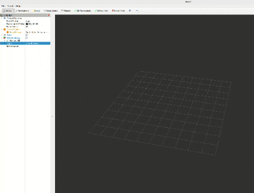
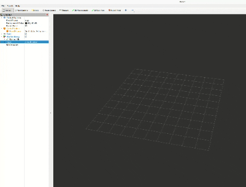
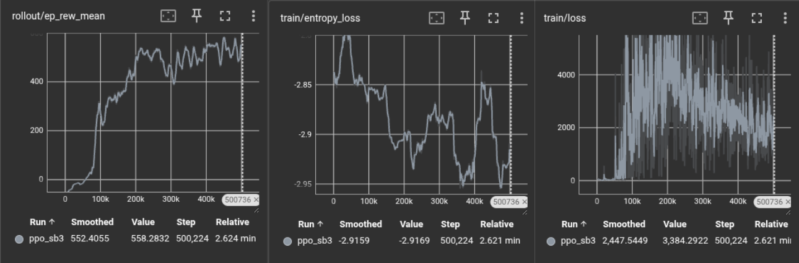
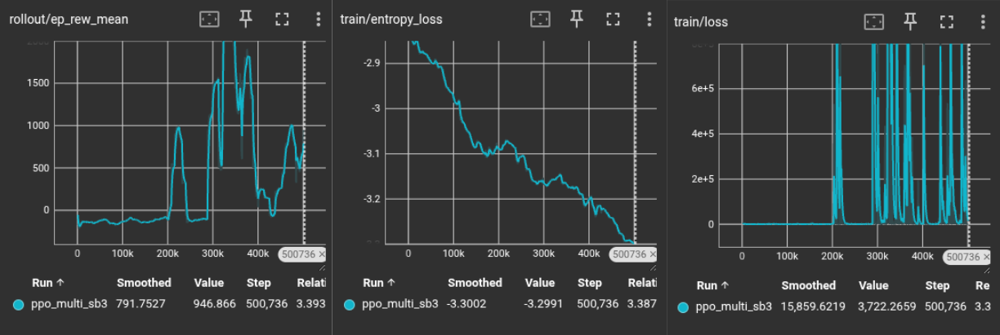
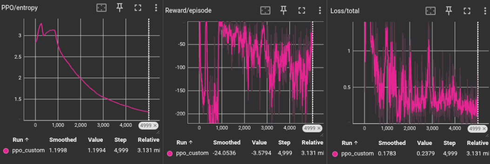
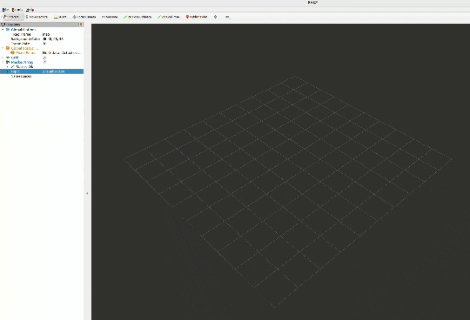

# 4-Wheel Steering Robot Autonomous Navigation Using RL

Reinforcement learning project for training a 4-wheel steering robot to navigate  and reach a random target autonomously using PPO (Proximal Policy Optimization). The robot learns smooth, efficient navigation with two training scenarios:

- **Single Robot Navigation**: Navigate to randomly spawned targets
- **Multi-Robot Collision Avoidance**: One agent (red) learns collision avoidance using RL by observing two robots (green) controlled by predefined P-controller policies

Built with Stable-Baselines3, Gymnasium, and ROS 2 integration for mcap visualization. This project also includes a successfull [custom PPO implementation](#custom-ppo-implementation) from scratch for deeper RL insights.

### Demo

<div align="center">
  <table>
    <tr>
      <td align="center"><strong>Single Robot Navigation</strong></td>
      <td align="center"><strong>Multi-Robot Collision Avoidance</strong></td>
    </tr>
    <tr>
      <td></td>
      <td></td>
    </tr>
  </table>
</div>

## Project Structure

```

├── src/                        # Core library code  
│   ├── kinematics.py          # 4-wheel steering physics kinematics model
│   ├── robot_gym.py           # Single-robot Gymnasium environment
│   ├── multirobot_gym.py      # Multi-robot environment for collision avoidance
│   └── vis_mcap.py            # MCAP visualization
│
├── scripts/                    # Executable scripts
│   ├── singlerobot_RL/        # Single Robot RL Environment using Stable-Baselines3 framework
│   │   ├── train.py           # Train single agent
│   │   └── play.py            # Play/Visualize single agent
│   │
│   ├── multirobot_RL/         # Multi-Robot RL environment
│   │   ├── train.py           # Train agent with 2 robots
│   │   └── play.py            # Run/Visualize multi-robot Setup
│   │
│   └── custom_ppo_singlerobot/ # Successful PPO implementation from scratch (Alternate approach for reference) 
│       ├── train_custom.py    # Train Script
│       └── play_custom.py     # Run custom trained policy
│
├── outputs/                    # Generated files
│   ├── models/                # Saved model weights (.pth, .zip)
│   ├── recordings/            # MCAP visualization files
│   └── logs/                  # TensorBoard training logs
│
└── requirements.txt           # Python dependencies
```

## Setup

### 1. Create Conda Environment

```bash
conda create -n 4wheel_robot python=3.10
conda activate 4wheel_robot
```

### 2. Install Dependencies

```bash
pip install -r requirements.txt
```

**Note**: To visualize MCAP files using RViz on Ubuntu/Linux with ROS 2, ensure `rclpy` and `visualization-msgs` are installed:
```bash
sudo apt-get install ros-<distro>-rclpy ros-<distro>-visualization-msgs
```

## Usage

### Single Robot Navigation

Train a single robot to reach a randomized target.

**Train:**
```bash
python3 scripts/singlerobot_RL/train.py --cpu --timesteps 500000
```

**Optional:**
- `--cpu`: Force CPU-only training (by default, GPU is used if available)
- `--timesteps`: Number of training steps (default: 500000)

**Training Curves:**


*To monitor these curves and other training parameters, refer to [TensorBoard](#monitoring-training) logs.*

**Play/Inference:**
```bash
python3 scripts/singlerobot_RL/play.py --model outputs/models/trained_policy_sb3.zip --episodes 3
```

This command runs inference on the trained policy. Each episode:
- Robot and target spawn at random positions within 10 m distance
- Records the trajectory and robot state to an MCAP file

The recorded episodes are saved to `outputs/recordings/policy_run_sb3.mcap` for visualization.

**Visualization Recorded mcap in RViz:**

1. **Play the recorded MCAP file after inference:**
```bash
source /opt/ros/<distro>/setup.bash
ros2 bag play outputs/recordings/policy_run_sb3.mcap -s mcap
```

2. **Launch RViz2 in another terminal:**
```bash
source /opt/ros/<distro>/setup.bash
rviz2
```

3. **Configure RViz:**
   - Add a **MarkerArray** visualization
   - Select the '/visualization' topic to visualize the recorded robot trajectory

**Visualize Training Process Recorded in mcap:**
To visualize the entire training process recorded every 200th episode:
```bash
source /opt/ros/<distro>/setup.bash
ros2 bag play outputs/recordings/training_run_sb3.mcap -s mcap
```

### Multi-Robot Collision Avoidance

Train an agent to navigate while avoiding two other dynamic robots that cross its path.
*   **Agent (Red)**: Learns to reach its target while avoiding collisions using PPO.
*   **Obstacles (Green)**: Follow a predefined proportional (P) controller with collision avoidance logic.

**Train:**
```bash
python3 scripts/multirobot_RL/train.py --cpu --timesteps 500000
```

**Optional:**
- `--cpu`: Force CPU-only training (by default, GPU is used if available)
- `--timesteps`: Number of training steps (default: 500000)

**Training Curves:**


*To monitor these curves and other training parameters, refer to [TensorBoard](#monitoring-training) logs.*

**Play/Inference:**
```bash
python3 scripts/multirobot_RL/play.py --model outputs/models/trained_policy_multi_sb3.zip --episodes 3
```

**Visualization Recorded mcap in RViz:**

1. **Play the recorded MCAP file after inference:**
```bash
source /opt/ros/<distro>/setup.bash
ros2 bag play outputs/recordings/policy_run_multi_sb3.mcap -s mcap
```

3. **Visualize Training Process Recorded in mcap:**
To visualize the entire training process recorded every 200th episode:
```bash
source /opt/ros/<distro>/setup.bash
ros2 bag play outputs/recordings/training_run_multi_sb3.mcap -s mcap
```

## Monitoring Training

### TensorBoard
View comprehensive training metrics including reward, loss, and other training parameters:
```bash
tensorboard --logdir outputs/logs --port 6006
```
Then open your browser to `http://localhost:6006` to visualize all training curves and metrics from both single-robot and multi-robot environments.

## RL Implementation Details

### Observation and Action Spaces

**Single Robot Observation** (4D):
- Distance to target
- Heading error to target (normalized: [-π, π])
- Current velocity (m/s): [0, 2.0]
- Current curvature (rad): [-1.5, 1.5]

**Multi-Robot Observation** (12D):
- Agent state: [distance, heading, velocity, curvature]
- Robot 2 relative position and velocity: [rel_x, rel_y, vx, vy]
- Robot 3 relative position and velocity: [rel_x, rel_y, vx, vy]

**Action Space** (2D continuous):
- Steering curvature (κ): [-1.5, 1.5] rad
- Velocity command (v): [0.0, 2.0] m/s

### Reward Function
The reward function is balanced to encourage smooth, efficient driving:
*   **Progress**: Reward for moving closer to target
*   **Heading**: Alignment bonus/penalty toward target direction
*   **Velocity**: Adaptive based on distance to target for smooth stopping
    - Far (> 1.0m): Encourage forward movement aligned with heading
    - Close (0.3-1.0m): smooth deceleration
    - At target (< 0.3m): Strong penalty for movement, bonus for stopping
*   **Curvature**: Prevent spiraling/orbiting
*   **Time Penalty**: Distance-proportional efficiency penalty
*   **Collision** (Multi-robot): -500.0 for hard collision, exponential penalty for proximity < 1.5m
*   **Terminal**: +500.0 for success, -10.0 for out of bounds, -5.0 for timeout

### Environments
1.  **Single Robot**: `src/robot_gym.py` - Standard point-to-point navigation.
2.  **Multi Robot**: `src/multirobot_gym.py` - 3-robot environment.
    *   **Robot 1 (red)**: RL Agent.
    *   **Robot 2 & 3 (green)**: scripted "smart" obstacles that avoid collisions.


## Custom PPO Implementation

A custom implementation of PPO (Proximal Policy Optimization) from scratch was developed and successfully trained for single-robot navigation. This alternative approach demonstrates a deeper understanding of RL fundamentals.

**Train:**
```bash
python3 scripts/custom_ppo_singlerobot/train_custom.py --cpu
```

**Options:**
- `--cpu`: Force CPU-only training (by default, GPU is used if available)

**Training Curves:**


*To monitor these curves and other training parameters, refer to [TensorBoard](#monitoring-training) logs.*

**Play/Inference:**
```bash
python3 scripts/custom_ppo_singlerobot/play_custom.py --model outputs/models/trained_policy_custom.pth --episodes 3
```

**Demo:**


**Results:**
Using Stablebasline gives better result in terms of network training and policy effectiveness.

